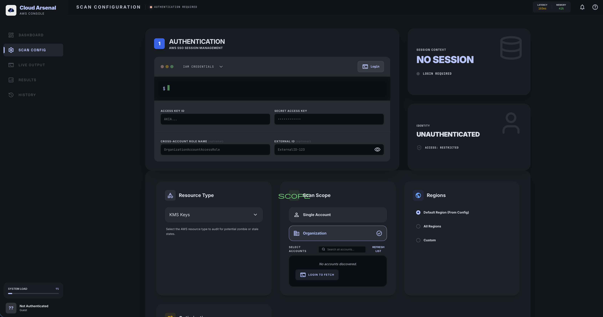
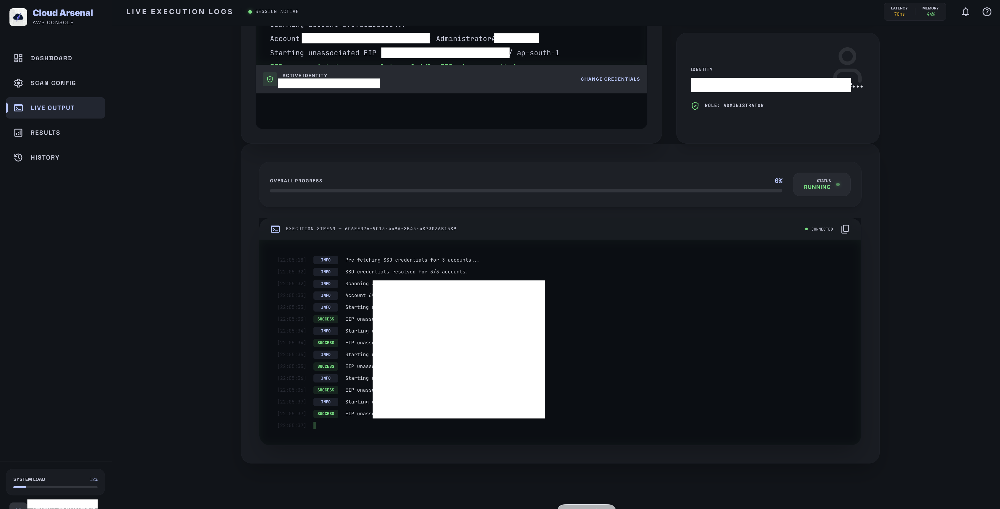
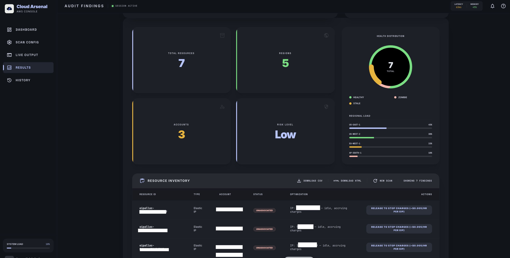

# Cloud Arsenal — AWS Console

A real-time AWS resource inventory and cost scanner with a React frontend and Python FastAPI backend. Scan your AWS infrastructure across accounts and regions — live.



| Live Execution | Audit Findings |
|---|---|
|  |  |

---

## What It Does

- **Multi-account scanning** — scan across an entire AWS Organization or a specific list of accounts using SSO token per-account credentials or cross-account role assumption
- **Real-time execution stream** — terminal-style log view showing exactly which account/region/scanner is running, which SSO role was used, and any skipped accounts
- **Account Dashboard** — aggregate summary (total accounts, spend, resources, access denied) with toggle to individual account breakdown; loads concurrently with two-phase prefetch
- **Resource Inventory** — tabular results with resource ID, type, region, status, and actionable detail; exportable to Excel or CSV
- **Identity-based history** — scan history stored in S3 keyed to your AWS identity (optional)
- **Plugin scanner architecture** — add a new scanner by dropping a single Python file into `scanners/`

---

## Architecture

```
Browser (React + TypeScript)
    │
    ├── REST (fetch)     → FastAPI (app.py)
    └── WebSocket (socketio-client) → python-socketio (ASGI)
                                          │
                                          ├── account_discovery.py   (SSO + Org account listing)
                                          ├── scan_executor.py       (multi-account scan loop)
                                          ├── scanners/*.py          (plugin scanners)
                                          ├── session_manager.py     (per-session AWS credentials)
                                          ├── terminal_handler.py    (aws sso login subprocess)
                                          └── s3_history.py          (optional scan history)
```

### Frontend
- **React 18 + TypeScript** — Vite build
- **Tailwind CSS** — dark-mode Material You UI
- **Framer Motion** — tab transitions and progress animations
- **socket.io-client** — real-time scan logs, progress, and account summary updates
- **xterm.js** — embedded terminal for interactive AWS SSO login

### Backend
- **FastAPI + Uvicorn** (ASGI)
- **python-socketio** — WebSocket server
- **boto3** — all AWS API calls
- **asyncio.to_thread** — boto3 calls run in a thread pool so the event loop stays unblocked
- **ptyprocess** — manages the `aws sso login` interactive subprocess
- **PYTHONUNBUFFERED=1** — ensures Docker stdout flushes immediately

---

## Authentication Modes

| Mode | Who Uses It | How It Works |
|------|-------------|--------------|
| **IAM Credentials** | Single-account users | Access Key + Secret Key (+ optional session token). Optional cross-account role. |
| **AWS SSO Token** | Any SSO user | OIDC device auth flow — browser opens AWS SSO URL, no CLI needed. Per-account SSO credentials fetched automatically via `sso.get_role_credentials`. |
| **SSO + Role Switch** | GlobalAdmin / CloudOps only | SSO login + assumes a management role (e.g. `ks-it-managed-automation`) across all org accounts. Requires Org Account ID, Role Name, External ID. |

### Auth Mode Field Matrix

| Field | IAM | AWS SSO Token | SSO + Role Switch |
|-------|-----|---------------|-------------------|
| Access Key / Secret | ✅ Required | — | — |
| Session Token | Optional | — | — |
| User Category | — | — | GlobalAdmin / CloudOps |
| Org Account ID | — | — | ✅ Required |
| Role Name | Optional | — | ✅ Required |
| External ID | Optional (masked) | — | ✅ Required (masked) |
| SSO URL / Region | — | Optional | Optional |

> **AWS SSO Token** hides all category and role fields — per-account credentials are resolved automatically from the SSO token without any role assumption config.

> **External ID** is always masked (password field) with a visibility toggle.

---

## SSO Login Flow (AWS SSO Token / SSO + Role Switch)

1. User clicks **Terminal** — backend registers an OIDC client and starts device authorization
2. A browser tab opens at the AWS verification URL (e.g. `https://device.sso.us-east-1.amazonaws.com/...`)
3. User approves in the browser — backend polls until the token is issued
4. Token is cached in the session's `.aws/sso/cache/` directory
5. Frontend auto-validates and discovers accounts via `sso.list_accounts`
6. All 190 (or N) accounts appear in the account selector — no manual entry needed

**SSO token cache fallback:** the app also reads the host's `~/.aws/sso/cache/` (mounted read-only via Docker volume), so a token from `aws sso login` run on the host Mac works too.

---

## Account Discovery

All modes use `sso.list_accounts(accessToken)` to get exactly the accounts visible to the logged-in user. For SSO modes this happens automatically after login. For IAM, the app falls back to AWS Organizations API, then to the current account.

---

## Account Dashboard

The Dashboard tab shows aggregate metrics across all accounts:

| Metric | Description |
|--------|-------------|
| Total Accounts | All accounts discovered, with breakdown: active · denied · loading |
| Current Month Spend | Sum of Cost Explorer current-month spend across all accessible accounts |
| Total Resources | Sum of running EC2 + S3 buckets + available RDS instances |
| Access Denied | Count of accounts where credentials couldn't be obtained |

Toggle **Individual Breakdown** to see per-account cards with spend, top services, and resource counts.

### Resource Counting

- **EC2** — only `running` instances (excludes stopped, terminated)
- **RDS** — only `available` instances (excludes stopped, backing-up, deleting)
- **S3** — all buckets (buckets always incur storage costs)

### Performance: Two-Phase Prefetch

For **AWS SSO Token** mode with many accounts:

1. **Phase 1 (semaphore=50)** — fetches SSO credentials for all accounts concurrently. Fast: API calls only, no heavy compute.
2. **Phase 2 (semaphore=25)** — runs Cost Explorer + EC2/S3/RDS queries in parallel using pre-fetched sessions.

This dramatically reduces total load time for large orgs (190 accounts resolves in seconds instead of minutes).

### SSO Role Selection

Each account may have multiple SSO permission sets (e.g. `AdministratorAccess`, `GlobalAdminAccess`, `tests3tag`). The app tries them in priority order:

1. `AdministratorAccess` (exact match)
2. Any name containing `admin`
3. All others

If a high-privilege role is blocked (MFA required, SCP condition), it falls through to the next available role. The scan log shows which role was ultimately used per account.

---

## Getting Started

### Prerequisites
- Node.js v18+
- Python 3.9+
- AWS CLI v2 (required for SSO terminal login)
- Docker (recommended)

### Local Development

```bash
# Install frontend dependencies
npm install

# Set up Python backend
python -m venv venv
source venv/bin/activate
pip install -r requirements.txt

# Start everything
npm run dev
```

Frontend: `http://localhost:5173` (Vite dev server default)

### Docker

```bash
# First run (or after code changes) — builds the image and starts the container
docker compose up --build -d

# Subsequent starts (no code changes) — just start the existing image
docker compose up -d
```

The app runs at **`http://localhost:8080`** — frontend and backend are served together by the same Uvicorn process on port 8080.

---

## Docker Operations

### Day-to-Day Commands

```bash
# Start (detached / background)
docker compose up -d

# Start and rebuild image (after any code change)
docker compose up --build -d

# Stop the container (keeps the image)
docker compose stop

# Stop and remove the container (keeps the image)
docker compose down

# Restart (e.g. after config.json change)
docker compose restart

# View live logs
docker compose logs -f

# View last 100 lines of logs
docker compose logs --tail=100
```

### Check Status

```bash
# Is the container running?
docker compose ps

# Full container details
docker ps -a | grep cloudops
```

### Port Already in Use

If `docker compose up` fails with `port 8080 already in use`:

```bash
# Find what is using port 8080
lsof -i :8080

# Kill it by PID (replace 12345 with the actual PID from above)
kill -9 12345

# Or stop a previous container that wasn't cleaned up
docker compose down
docker compose up -d
```

### After Code Changes

```bash
# Rebuild image and restart in one command
docker compose up --build -d

# Verify it came back up
docker compose ps
docker compose logs --tail=20
```

### Clean Slate

```bash
# Stop and remove container + image
docker compose down --rmi local

# Then rebuild fresh
docker compose up --build -d
```

### Port Reference

| Service | Port | URL |
|---|---|---|
| App (frontend + backend) | 8080 | `http://localhost:8080` |

> Sessions and reports are persisted in `/tmp/cloudops-sessions` and `/tmp/cloudops-reports` on the host, so they survive container restarts.

### AWS Config Mount

The host `~/.aws` directory is mounted read-only into the container:

```yaml
volumes:
  - ~/.aws:/root/.aws:ro
```

This gives the app access to:
- `~/.aws/config` — named SSO sessions (e.g. `[sso-session CloudScriptSSO]`) for the terminal login command
- `~/.aws/sso/cache/` — cached SSO tokens from a prior `aws sso login` on the host Mac

---

## Configuration (`config.json`)

```json
{
  "aws": {
    "sso_session_name": "CloudScriptSSO",
    "sso_start_url": "https://your-sso.awsapps.com/start",
    "sso_region": "us-east-1",
    "default_region": "us-west-2",
    "role_name": "ks-it-managed-automation"
  },
  "accounts": [],
  "session_timeout_minutes": 60,
  "s3_upload": {
    "enabled": true,
    "bucket": "your-s3-bucket-for-history",
    "prefix": "users"
  }
}
```

If `s3_upload` is not configured or the bucket is absent, scan history is silently disabled — core scanning still works.

---

## Built-in Scanners

| Scanner Name | File | What It Finds |
|---|---|---|
| `KMS Zombie Keys` | `kms_zombie.py` | KMS keys with no recent usage (idle, accruing charges) |
| `Unused ALBs` | `alb_unused.py` | Application/Network Load Balancers with no healthy targets |
| `EC2 Instances` | `ec2_instances.py` | Running and stopped EC2 instances with AZ, name, private IP |
| `S3 Buckets` | `s3_buckets.py` | All S3 buckets with region and creation date (runs once from us-east-1) |
| `EIP Addresses` | `eip_addresses.py` | All Elastic IPs with association status, domain, and attached instance |
| `EIP Unassociated` | `eip_unassociated.py` | Only unassociated EIPs — idle, accruing ~$0.005/hr each |

> **Opt-in regions:** If an account hasn't enabled a region (e.g. eu-south-1), the scanner receives an `AuthFailure` from AWS. This is caught and logged as `WARN | Skipping region — not enabled` rather than a hard error. Scanning continues.

---

## Scanner Plugin Contract

Drop a `.py` file in `scanners/`. It must define:

```python
import json

SCANNER_NAME = "My Scanner"          # must match the dropdown value in the UI
SCANNER_DESCRIPTION = "What it does"

def run(session, account_id, region, idle_days=30, verbose=False, **kwargs):
    yield f"INFO | Starting scan for {account_id} / {region}"

    # boto3 client using the per-account session
    client = session.client('ec2', region_name=region)

    result = {
        'id':           'resource-id',       # unique resource identifier
        'type':         'EC2 Instance',       # human label for the resource type
        'account':      account_id,
        'region':       region,
        'status':       'running',            # resource state (running, stopped, Unassociated, etc.)
        'optimization': 't2.micro',           # instance type, key policy, or other key attribute
        'action':       'AZ: us-east-1a'      # additional detail shown in the Actions column
    }
    yield f"RESULT | {json.dumps(result)}"

    yield "SUCCESS | Scan complete."
```

**Output line protocol:**
- `INFO | …` — informational log
- `RESULT | {json}` — a resource finding (added to the results table)
- `SUCCESS | …` — scan finished successfully
- `ERROR | …` — caught exception (scan continues to next account/region)
- `WARN | …` — non-fatal skip (e.g. region not enabled)

> **Python 3.11 f-string gotcha:** you cannot use dict-literal expressions inside f-strings in Python 3.11+. Build the result dict first, then `json.dumps(result)` in the yield.

After adding the file, register the scanner name in the frontend dropdown (`src/App.tsx`).

---

## Results View Stats

| Stat | Source |
|------|--------|
| Total Resources | Count of all RESULT lines from the scan |
| Regions | Unique `region` values across all findings |
| Accounts | Count of accounts that reached the scan stage (including accounts with 0 findings) |
| Risk Level | Currently static `Low` (future: severity-driven) |

---

## Security & Privacy

- **Session isolation** — credentials and AWS config isolated per session in `/tmp/sessions/{session_id}/`
- **No persistent credential storage** — credentials kept in memory only for the session duration; never written to a database
- **Read-only** — all scanner calls use `Describe*` and `List*` AWS APIs only; nothing is modified or deleted
- **Identity hashing** — S3 history keys are SHA256 hashes of the AWS identity; raw identity is never stored
- **External ID masked** — External ID fields render as password inputs with a visibility toggle

---

## Fixes Log

| # | File | Issue | Fix |
|---|------|-------|-----|
| 1 | `backend/app.py` | IAM auth used server credentials instead of user's in-memory keys | STS client built from `CREDENTIAL_STORE` |
| 2 | `backend/app.py` | History S3 bucket read from wrong config key | Fixed to read from `s3_upload.bucket` |
| 3 | `backend/app.py` | `GET /api/history` returned raw list; frontend expected object | Fixed response shape |
| 4 | `src/App.tsx` | Account discovery mapped `{id: wholeObject}` instead of `{id, name}` | Fixed mapping |
| 5 | `backend/utils.py` | Account ID validation too permissive | Regex changed to `^\d{12}$` |
| 6 | `backend/utils.py` + `session_manager.py` | UUID pattern duplicated and too permissive | Strict UUID v4; `session_manager.py` imports from `utils.py` |
| 7 | `backend/app.py` | `sio.enter_room()` missing `await` — clients never joined rooms; all socket events dropped | Added `await` |
| 8 | `backend/app.py` | boto3 calls blocking asyncio event loop; Account Summary events queued but never flushed | Extracted boto3 work to `_fetch_account_data_sync`, called via `asyncio.to_thread()` |
| 9 | `backend/scan_executor.py` | Scan events emitted to `room=run_id`; frontend only joined `room=session_id` | Changed to `room = session["session_id"]` |
| 10 | `Dockerfile` | Python stdout buffered in Docker; no logs visible | Added `ENV PYTHONUNBUFFERED=1` |
| 11 | `scanners/ec2_instances.py` | f-string with nested dict quotes: `SyntaxError: unterminated string literal` (Python 3.11) | Build result dict first, then `json.dumps(result)` in the yield |
| 12 | `backend/scan_executor.py` | `AuthFailure` on opt-in regions logged as hard ERROR | Caught and re-logged as `WARN | region not enabled` |
| 13 | `backend/app.py` | SSO terminal used wrong session name (`config.json` value vs real `~/.aws/config`) | Reads actual `[sso-session …]` name from copied config file |
| 14 | `backend/app.py` | Docker OAuth callback (`127.0.0.1`) unreachable from host browser | Replaced `aws sso login` CLI with OIDC device auth flow (`sso-oidc` boto3 client) |
| 15 | `backend/app.py` | Account Summary used hub credentials for all accounts in SSO mode — always returned 0 | SSO Token mode now uses `sso.get_role_credentials` per account; IAM/SSO_ROLE unchanged |
| 16 | `backend/app.py` + `scan_executor.py` | `list_account_roles` only read first page — accounts with paginated roles missed | Added full pagination loop for `list_account_roles` |
| 17 | `backend/scan_executor.py` | SSO scan used first role returned (e.g. `tests3tag` — no EC2 perms) instead of most privileged | Roles sorted by priority (AdministratorAccess → *Admin* → others); falls through on failure |
| 18 | `backend/app.py` | Account Dashboard EC2 count included all reservations + stopped instances | EC2 filter: `running` only; RDS filter: `available` only |
| 19 | `src/App.tsx` | Accounts stat showed only accounts with findings; accounts with 0 results not counted | Tracks accounts from `INFO | Scanning account X` log lines |

---

## Roadmap

- **SSO + Role Switch infrastructure** — deploy `ks-it-managed-automation` to all member accounts via StackSet with correct trust policy to enable org-wide role assumption scanning
- **Risk scoring** — severity-based Risk Level driven by finding type (unassociated EIP = low, public S3 = high, etc.)
- **Script integration (IOL4)** — sanitize and integrate existing Cloud Onboarding scripts as GlobalAdmin-only plugins; plugin contract extension with parameter schemas and safe execution UI
- **Phase 2: AI Chat** — natural language queries over scan results ("which accounts have the most stopped instances?")
